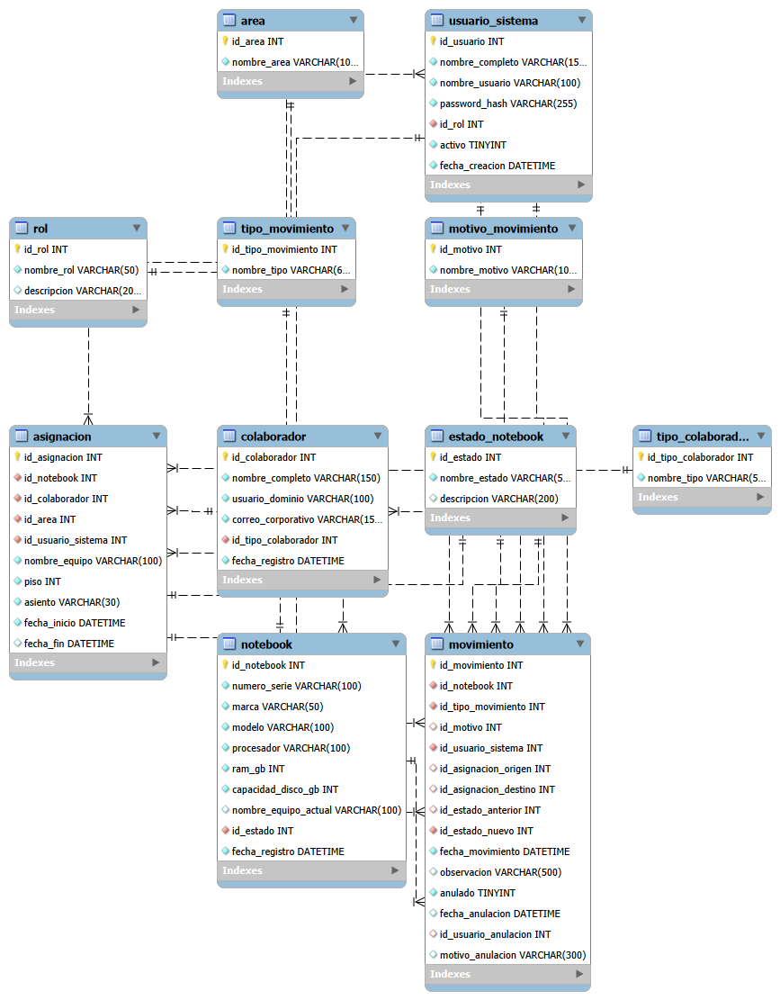

# SIGATI

## Sistema de Gestión de Activos Tecnológicos de Infraestructura

SIGATI es un proyecto de titulación orientado a mejorar la gestión y trazabilidad de notebooks dentro de un entorno organizacional.

El sistema busca centralizar la información de los equipos, colaboradores, asignaciones, estados y movimientos, permitiendo conocer quién tuvo un notebook, dónde estuvo asignado, qué cambios tuvo y qué técnico realizó cada modificación.

---

## Objetivo del proyecto

Diseñar e implementar una solución web que permita gestionar activos tecnológicos de forma estructurada, segura y trazable.

Entre sus principales objetivos se encuentran:

- Registrar notebooks y sus características técnicas.
- Gestionar colaboradores y tipos de colaborador.
- Registrar asignaciones y reasignaciones.
- Mantener una Hoja de Vida Digital de cada notebook.
- Gestionar estados como Ingresado, En preparación, Asignado, TBA, Desactivado y Decomisado.
- Registrar al usuario TI responsable de cada cambio.
- Consultar información histórica de los equipos.
- Generar indicadores y análisis sobre el comportamiento del inventario.

---

## Tecnologías propuestas

### Aplicación Web
- HTML5
- CSS3
- Bootstrap
- JavaScript
- PHP

### Base de Datos
- MySQL 8.0
- MySQL Workbench

### Analítica / Big Data
- Apache Spark como componente analítico complementario para procesamiento de datos históricos e indicadores.

---

## Arquitectura

SIGATI utiliza una arquitectura web de tres capas:

1. **Capa de presentación**
   - Interfaz web utilizada por los usuarios.

2. **Capa de negocio**
   - Implementada mediante PHP.
   - Gestionará autenticación, permisos, reglas de negocio, asignaciones y movimientos.

3. **Capa de datos**
   - Implementada en MySQL.
   - Mantiene la estructura relacional, integridad referencial e historial de los activos.

Apache Spark se considera como componente complementario para análisis de grandes volúmenes de datos históricos.

---

## Base de Datos

La base de datos utiliza un modelo relacional normalizado.

Actualmente está compuesta por 11 tablas:

- `area`
- `asignacion`
- `colaborador`
- `estado_notebook`
- `motivo_movimiento`
- `movimiento`
- `notebook`
- `rol`
- `tipo_colaborador`
- `tipo_movimiento`
- `usuario_sistema`

Se aplican:

- Claves primarias.
- Claves foráneas.
- Restricciones UNIQUE.
- Restricciones NOT NULL.
- Restricciones CHECK.
- Integridad referencial.
- ON DELETE RESTRICT.
- Índices para consultas frecuentes.

---

## Diagrama EER

El siguiente diagrama representa el modelo relacional actual de SIGATI:

---

## Hoja de Vida Digital

Cada notebook mantiene un historial de movimientos que permite registrar:

- Tipo de movimiento.
- Estado anterior.
- Estado nuevo.
- Asignación anterior.
- Asignación nueva.
- Motivo.
- Fecha del movimiento.
- Observaciones.
- Usuario TI responsable.

Esto permite representar situaciones como:

> Reasignado de Juan Pérez a María Soto.

---

## Ciberseguridad

SIGATI considera las siguientes medidas:

- Autenticación de usuarios.
- Control de acceso mediante roles.
- Rol Administrador TI.
- Rol de Consulta.
- Almacenamiento de contraseñas mediante hash.
- Principio de mínimo privilegio.
- Integridad referencial en la base de datos.
- Auditoría de los movimientos realizados.
- Uso de HTTPS en la aplicación web.

---

## Analítica y Big Data

El sistema considera Apache Spark como componente analítico complementario.

Los datos históricos podrán utilizarse para generar análisis como:

- Modelos con mayor cantidad de fallas.
- Motivos más frecuentes de decomiso.
- Cantidad de reasignaciones por período.
- Vida útil promedio de los notebooks.
- Equipos candidatos a renovación.
- Tendencias del parque tecnológico.

MySQL continuará siendo la base operacional principal del sistema.

---

## Estado actual del proyecto

Actualmente se encuentra desarrollado:

- Diseño del modelo relacional.
- Normalización de la base de datos.
- Creación de las 11 tablas.
- Claves primarias y foráneas.
- Integridad referencial.
- Restricciones e índices.
- Diagrama EER.
- Diccionario de datos.
- Reglas de negocio.
- Arquitectura propuesta.
- Árbol funcional.
- Prototipo visual de la aplicación.
- Pruebas con datos ficticios.
- Validación de asignaciones, TBA y reasignaciones.
- Validación de restricciones de integridad.

---

## Archivos disponibles

### `SIGATI_BD_Final.sql`

Script SQL consolidado que permite crear desde cero la estructura de la base de datos SIGATI.

### `SIGATI_Diagrama_EER.png`

Diagrama Entidad-Relación generado desde MySQL Workbench.

---

## Proyecto académico

Este repositorio corresponde a un proyecto de titulación académico y utiliza datos ficticios para las pruebas y demostraciones.
